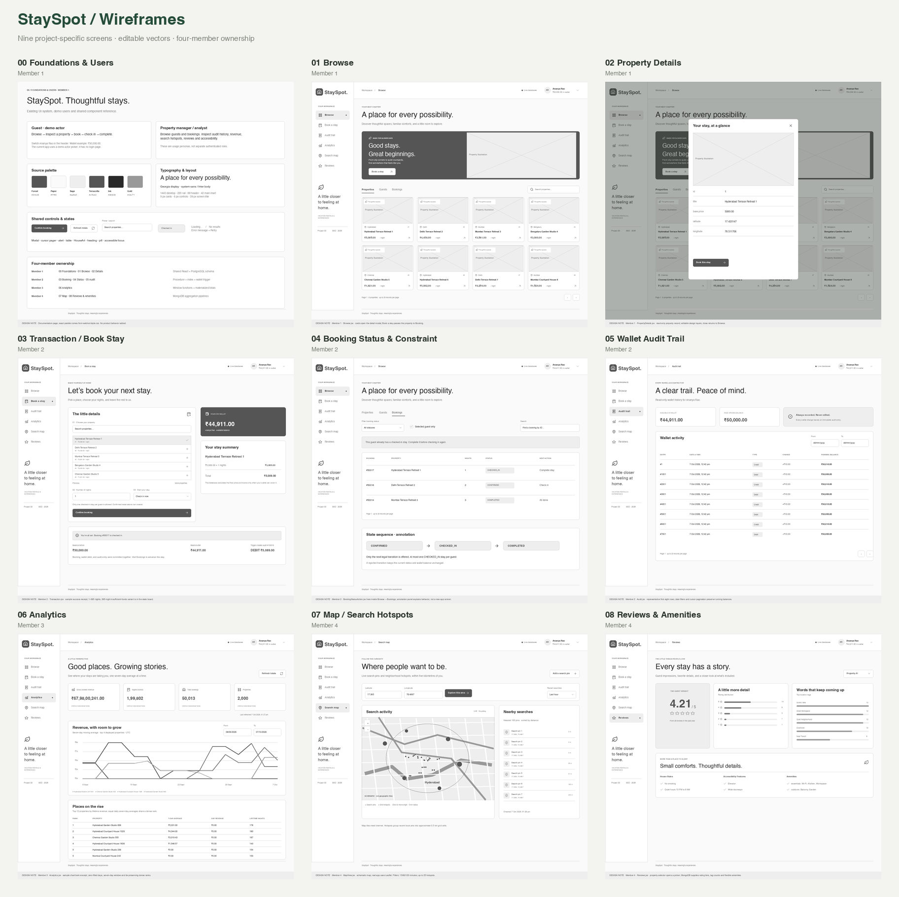

# StaySpot wireframes and UI reference

This handover documents the existing **StaySpot Assignment 2 application**. It includes the nine screens in the supplied four-member allocation, an editable Excalidraw wireframe board, a colored UI reference board, and six alternative interaction states. The application UI, CSS, APIs and database behavior are unchanged.

Open [preview.html](preview.html) locally for a gallery with wireframe/UI switching and member filters. No server, Docker, database or dependency installation is needed to view the designs.



## Editable boards

| File | Contents |
|---|---|
| [StaySpot-wireframes.excalidraw](StaySpot-wireframes.excalidraw) | Nine low-fidelity frames; native text, shapes and grouped vector icons |
| [StaySpot-ui-reference.excalidraw](StaySpot-ui-reference.excalidraw) | Nine colored reference frames; editable artwork, controls and text |
| [StaySpot-interaction-states.excalidraw](StaySpot-interaction-states.excalidraw) | Success, insufficient balance, active-stay conflict, loading/empty, error/retry and demo guest switching |
| [UI overview](ui-reference-overview.png) | Shareable image of all nine colored reference screens |
| [Interaction states](interaction-states.svg) | Scalable vector version of the state board |

To edit a board:

1. Save its `.excalidraw` file locally. If using GitHub, download the raw file rather than the HTML file page.
2. Open [Excalidraw](https://excalidraw.com).
3. Use the top-left menu → **Open** and choose the file. Dragging the file onto the canvas is another option.
4. Zoom to a screen and select an element. Related controls are grouped; ungroup to edit individual shapes. Text is editable directly.
5. Save the edited board through the menu. Export a selected frame as SVG or PNG when sharing it.

The files use Excalidraw's version 2 JSON format and contain native elements, with no full-screen images. [Excalidraw's restoration documentation](https://docs.excalidraw.com/docs/@excalidraw/excalidraw/api/utils/restore) describes how imported scene data is restored.

## Screen ownership and code mapping

Each row has an editable SVG wireframe and a colored SVG reference. Matching PNG previews are in the same folders.

| Screen | Member | Wireframe | UI reference | Existing source / behavior |
|---|---|---|---|---|
| 00 Foundations & Users | 1 | [SVG](wireframes/00_foundations.svg) | [SVG](ui-mockups/00_foundations.svg) | `App.jsx`, shared components, `web/src/style.css`; guest and manager/analyst personas |
| 01 Browse | 1 | [SVG](wireframes/01_browse.svg) | [SVG](ui-mockups/01_browse.svg) | `member1/web/Browse.jsx`; property cards, guests/bookings tabs, search and cursor pages |
| 02 Property Details | 1 | [SVG](wireframes/02_property_details.svg) | [SVG](ui-mockups/02_property_details.svg) | `member1/web/PropertyDetails.jsx`; record modal, close and Book this stay |
| 03 Transaction / Book Stay | 2 | [SVG](wireframes/03_book_stay.svg) | [SVG](ui-mockups/03_book_stay.svg) | `member2/web/Transaction.jsx`; property picker, nights, initial status, quote, committed receipt |
| 04 Booking Status & Constraint | 2 | [SVG](wireframes/04_booking_status.svg) | [SVG](ui-mockups/04_booking_status.svg) | `member2/web/BookingStatusAction.jsx` inside Browse → Bookings; Check in / Complete stay |
| 05 Wallet Audit Trail | 2 | [SVG](wireframes/05_wallet_audit.svg) | [SVG](ui-mockups/05_wallet_audit.svg) | `member2/web/Audit.jsx`; date filters, immutable entries, opening/running balances |
| 06 Analytics | 3 | [SVG](wireframes/06_analytics.svg) | [SVG](ui-mockups/06_analytics.svg) | `member3/web/Analytics.jsx`, `LineChart.jsx`; materialized totals, refresh, seven-day average, daily dense rank |
| 07 Map / Search Hotspots | 4 | [SVG](wireframes/07_search_map.svg) | [SVG](ui-mockups/07_search_map.svg) | `member4/web/MapView.jsx`; origin, recency, 5 km radius, nearby pins, hotspots, polling and add-pin |
| 08 Reviews & Amenities | 4 | [SVG](wireframes/08_reviews.svg) | [SVG](ui-mockups/08_reviews.svg) | `member4/web/Reviews.jsx`; property selector, average, five rating buckets, tags and flexible amenities |

Source paths above are relative to `members/`, except the global stylesheet. Database responsibilities remain in each member's SQL/MongoDB folders; see the [member guide](../../members/README.md).

## Fidelity and interaction notes

- **00 is documentation**, not a new login or role-management screen. The app uses a demo guest picker; the personas do not imply separate authenticated roles.
- **02 is a modal over Browse**, not a separate navigation destination. Closing it returns to Browse. Book this stay selects the property and navigates to Booking.
- **04 represents Browse → Bookings.** The state-sequence panel is a labeled design annotation. Legal actions are `CONFIRMED → CHECKED_IN → COMPLETED`. A guest can have several confirmed reservations and at most one checked-in stay.
- **03 shows a sample committed receipt:** one night at ₹5,089 debits ₹50,000 to ₹44,911 and creates the trigger audit. The separate state board shows a 365-night ₹18,57,485 insufficient-balance attempt and the active-stay conflict. Each error scenario is independent; it is not additional committed demo data.
- Audit and Analytics show **representative row excerpts**, not full data exports. Audit remains paginated at up to 20 rows; the analytics cohort remains top 12 with four charted series. The chart paths are illustrative rather than a replacement for computed revenue.
- **07 uses a clearly labeled schematic map**, with editable streets, origin, radius and marks. It does not claim geographic tile accuracy. The running app continues to use Leaflet and attributed OpenStreetMap tiles. The real filters are 15/60/120 minutes, 100 nearest pins, up to 25 hotspots and 15-second polling.
- UI SVGs use the existing forest/paper/sage/terracotta palette, Georgia display type, the system body stack, source `HouseArt`, and source Lucide vectors. Excalidraw uses its built-in **Helvetica** text; it does not preserve Georgia or bold weights. Use the SVG references when typography fidelity matters.
- The desktop reference is **1440 × 1280**, with a 220 px rail, 88 px header and 42 px main inset. Table content is abbreviated to fit this fixed reference height. The original [browser screenshots](../screenshots/) remain the evidence for the running app, including [mobile Browse](../screenshots/08_mobile_browse.png) and [mobile Reviews](../screenshots/07_mobile_reviews.png). On phones, the existing navigation wraps, panels stack and tables scroll inside their panels.

Figma's Starter-plan MCP quota prevented the native Figma build. Excalidraw is the completed editable deliverable. If desired, drag individual SVG exports into a Figma Design canvas, then review font substitution and vector grouping. SVG import is not a native Figma component library or a linked prototype.

## Reproduce the exports

Viewing or editing the boards does not require these tools. Regeneration is optional:

```bash
# From the repository root, create an isolated environment for the design script.
python3 -m venv .design-venv
.design-venv/bin/python -m pip install -r docs/design/requirements.txt
.design-venv/bin/python docs/design/generate_design.py
```

The generator reads [design_tokens.json](design_tokens.json) and checked-in [source SVG assets](source-assets/source-assets.json). It exports SVG, PNG, Excalidraw boards and overview images. It validates SVG XML, unique element IDs, valid frame references and nonnegative element dimensions. PNG previews use local Helvetica/Georgia on macOS and a DejaVu fallback on Linux; exact typography depends on the installed fonts. It uses no browser, network, API or database connection.

If the app's house illustration or icon set changes, refresh the source vectors after `npm ci`:

```bash
node docs/design/source-assets/prepare-assets.mjs
.design-venv/bin/python docs/design/generate_design.py
```

The asset extractor renders the existing React `HouseArt` and installed `lucide-react` components. It removes its own temporary module after extraction. The scene definitions are organized by screen and include comments explaining each visual/export step.

Validation performed: all 19 SVGs parsed; all three Excalidraw boards passed structural checks; all desktop text stayed within the screen bounds; contact sheets and key detail, booking, map, reviews and state previews were inspected locally. Excalidraw browser import was not exercised during this session.

The six SVGs directly in this folder are earlier pre-build sketches. The new `wireframes/` and `ui-mockups/` folders are the current handover.
